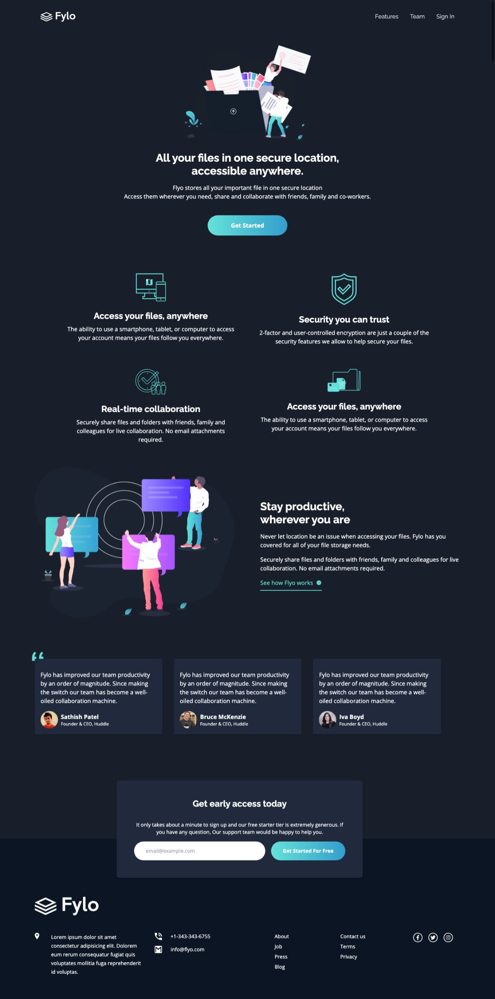
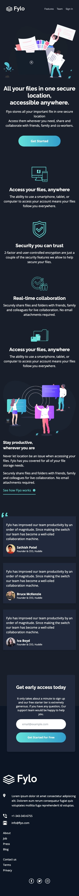

# Frontend Mentor - Fylo dark theme landing page solution

This is a solution to the [Fylo dark theme landing page challenge on Frontend Mentor](https://www.frontendmentor.io/challenges/fylo-dark-theme-landing-page-5ca5f2d21e82137ec91a50fd). Frontend Mentor challenges help you improve your coding skills by building realistic projects.

## Table of contents

- [Overview](#overview)
  - [The challenge](#the-challenge)
  - [Screenshot](#screenshot)
  - [Links](#links)
- [My process](#my-process)
  - [Built with](#built-with)
  - [Continued development](#continued-development)
- [Author](#author)

## Overview

### The challenge

Users should be able to:

- View the optimal layout for the site depending on their device's screen size
- See hover states for all interactive elements on the page

### Screenshot

### Links

- Solution URL: [Solution URL](https://github.com/sefedev/flyo-landing-page)
- Live Site URL: [Live site URL](https://sefe-flyo-landing-page.netlify.app/)

## My process

### Built with

- Semantic HTML5 markup
- Flexbox
- CSS Grid
- Mobile-first workflow
- [React](https://reactjs.org/) - JS library
- [Tailwind CSS](https://tailwindcss.com//) - Tailwind Css
- [ViteJs](https://vitejs.dev/) - Project Setup/Scaffold

### Continued development

Would likely Add the SVG Image to the Background

## Author

- Frontend Mentor - [@omosefe2020](https://www.frontendmentor.io/profile/omosefe2020)
- Twitter - [@sephiano1](https://www.twitter.com/sephiano1)
